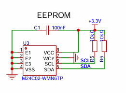

# 5. EEPROM

# 原理图


# 驱动
## Int_M24C02.h
```c
#ifndef __INT_M24C02_H__
#define __INT_M24C02_H__

#include "i2c.h"	//使用 i2c2
#include "Com_Debug.h"
#include "FreeRTOS.h"
#include "task.h"

#define M24C02_ADDR 0xA0
#define M24C02_ADDR_W 0xA0
#define M24C02_ADDR_R 0xA1

/**
 * @brief 初始化
 */
void Int_M24C02_Init(void);

/**
 * @brief 写一个字节
 */
void Int_M24C02_WriteByte(uint8_t byte_addr, uint8_t data);

/**
 * @brief 写多个字节
 */
void Int_M24C02_WriteBytes(uint8_t byte_addr, uint8_t *data, uint8_t len);

/**
 * @brief 读一个字节
 */
void Int_M24C02_ReadByte(int8_t byte_addr, uint8_t *data);

/**
 * @brief 读多个字节
 */
void Int_M24C02_ReadBytes(uint8_t byte_addr, uint8_t *data, uint8_t len);

#endif /* __INT_M24C02_H__ */

```

## Int_M24C02.c
```c
#include "Int_M24C02.h"

/**
 * @brief 初始化
 */
void Int_M24C02_Init(void) {}

/**
 * @brief 写一个字节
 */
void Int_M24C02_WriteByte(uint8_t byte_addr, uint8_t data)
{
    while (HAL_I2C_GetState(&hi2c2) != HAL_I2C_STATE_READY)
    {
        vTaskDelay(1); // 等待 I2C 就绪
    }
    HAL_I2C_Mem_Write(&hi2c2, M24C02_ADDR_W, byte_addr, I2C_MEMADD_SIZE_8BIT, &data, 1, 1000);
    vTaskDelay(10);
}

/**
 * @brief 写多个字节
 */
void Int_M24C02_WriteBytes(uint8_t byte_addr, uint8_t *data, uint8_t len)
{
    while (HAL_I2C_GetState(&hi2c2) != HAL_I2C_STATE_READY)
    {
        vTaskDelay(1); // 等待 I2C 就绪
    }
    HAL_I2C_Mem_Write(&hi2c2, M24C02_ADDR_W, byte_addr, I2C_MEMADD_SIZE_8BIT, data, len, 1000);
    vTaskDelay(10);
}

/**
 * @brief 读一个字节
 */
void Int_M24C02_ReadByte(int8_t byte_addr, uint8_t *data)
{
    HAL_I2C_Mem_Read(&hi2c2, M24C02_ADDR_R, byte_addr, I2C_MEMADD_SIZE_8BIT, data, 1, 1000);
}

/**
 * @brief 读多个字节
 */
void Int_M24C02_ReadBytes(uint8_t byte_addr, uint8_t *data, uint8_t len)
{
    HAL_I2C_Mem_Read(&hi2c2, M24C02_ADDR_R, byte_addr, I2C_MEMADD_SIZE_8BIT, data, len, 1000);
}

```


# 测试
## App_Task.h
```c
#include "Int_M24C02.h"
```

## App_Task.c
随意找位置测试

```c
Int_M24C02_Init();
Int_M24C02_WriteBytes(0, "hello world", 12);
uint8_t data[12];
Int_M24C02_ReadBytes(0, data, 12);
debug_printfln("data:%s", data);
```

