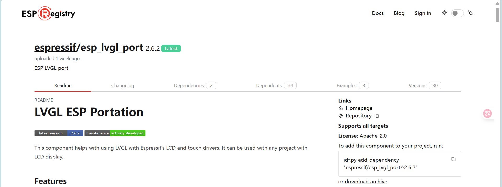
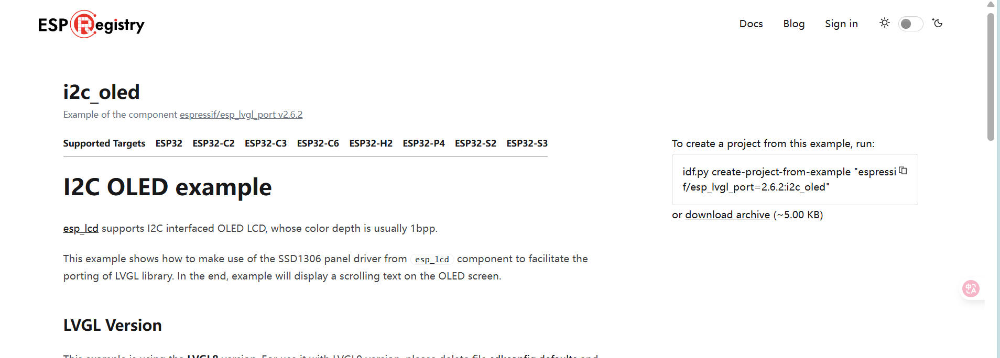

# oled ssd1315

可使用ssd1306

## 组件:



[espressif/esp_lvgl_port • v2.6.2 • ESP Component Registry](https://components.espressif.com/components/espressif/esp_lvgl_port/versions/2.6.2/readme?language=en) 

```
idf.py add-dependency "espressif/esp_lvgl_port^2.6.2"
```



 [espressif/esp_lvgl_port - 2.6.2 - Example i2c_oled • ESP Component Registry](https://components.espressif.com/components/espressif/esp_lvgl_port/versions/2.6.2/examples/i2c_oled?language=) 

```c
idf.py create-project-from-example "espressif/esp_lvgl_port=2.6.2:i2c_oled"
```

