# 物联网(IOT)通信之CAN通讯

#  CAN通讯介绍  
参考：[https://www.kvaser.cn/about-can/can-protocol-tutorial/](https://www.kvaser.cn/about-can/can-protocol-tutorial/)

CAN（Controller Area Network 控制器局域网，简称CAN或者CAN bus）是一种功能丰富的车用总线标准。被设计用于在不需要主机（Host）的情况下，允许网络上的单片机和仪器相互通信。

<font style="color:#FF0000;">它基于消息传递协议，设计之初在车辆上复用通信线缆，以降低铜线使用量，后来也被其他行业所使用。</font>

CAN拥有了良好的弹性调整能力，可以在现有网络中增加节点而不用在软、硬件上做出调整。除此之外，消息的传递不基于特殊种类的节点，增加了升级网络的便利性。

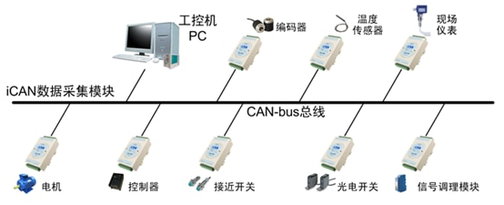

## 协议层
### CAN的帧（报文）种类
CAN总线是广播类型的总线。这意味着所有节点都可以侦听到所有传输的报文。无法将报文单独发送给指定节点；所有节点都将始终捕获所有报文。但是CAN硬件能够提供**<font style="color:#FF0000;">本地过滤</font>**功能，让每个节点对报文有选择性地做出响应。

CAN使用短报文，最大实用负载是94位。报文中没有任何明确的地址；相反，可以认为报文是通过内容寻址，也就是说，报文的内容隐式地确定其地址。

CAN总线上有5种不同的报文类型（或“帧”）：数据帧、远程帧、错误帧、过载帧和帧间隔。

+ 数据帧 

数据帧是最常见的报文类型，用于**<font style="color:#FF0000;">发送单元向接收单元发送数据</font>**。

+ 远程帧（遥控帧）

远程帧用于接收单元向具有相同id的发送单元请求发送数据。

+ 错误帧

错误帧当检测出错误时向其他单元通知错误的帧。

+ 过载帧

过载帧并不常用，因为当今的CAN控制器会非常智能化地避免使用过载帧。

+ 帧间隔

用于将数据帧及遥控帧与前面的帧分离开来的帧

其中**<font style="color:#FF0000;">错误帧、过载帧、帧间隔</font>**都是由硬件自动完成的，没有办法用软件来控制。对于一般使用者来说，只需要**<font style="color:#FF0000;">掌握数据帧与遥控帧</font>**。数据帧和遥控帧有标准格式与扩展格式。标准格式有11位标识符，扩展格式有29位标识符。

### 远程帧介绍
远程帧与数据帧相比**<font style="color:#FF0000;">没有数据段</font>**。

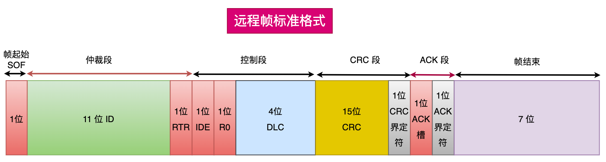

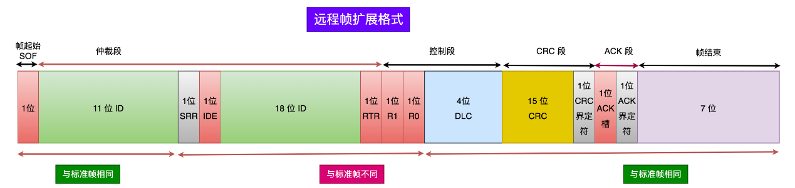

### CAN总线仲裁
CAN总线处于空闲状态的时候，最先发送消息的单元获得发送权。

多个单元同时开始发送时，从仲裁段（报文id）的第一位开始进行仲裁。连续输出显性电平最多的单元可以继续发送，即首先出现隐性电平的单元失去对总线的占有权变为接收。（即报文id小的优先级高）。

竞争失败，会自动检测总线空闲，在第一时间再次尝试发送。

# STM32的CAN外设
## CAN外设（CAN控制器）介绍
STM32的芯片中具有bxCAN控制器（Basic Extended CAN），它支持CAN协议2.0A 和2.0B Active标准。（CAN2.0A只能处理标准数据帧且扩展帧的内容会识别错误。而CAN2.0 B Active可以处理标准数据帧和扩展数据帧。CAN2.0 B Passive只能处理标准数据帧而扩展帧的内容会被忽略）。

该CAN控制器支持最高的通讯速率为1Mb/s；可以自动地接收和发送CAN报文，支持使用标准ID和扩展ID的报文；外设中具有3个发送邮箱，发送报文的优先级可以使用软件控制，还可以记录发送的时间；具有2个3级深度的接收FIFO，可使用过滤功能只接收或不接收某些ID号的报文；可配置成自动重发；**<font style="color:#FF0000;">不支持使用DMA</font>**进行数据收发。

## CAN控制器的3种工作模式
CAN控制器有3种工作模式：初始化模式、正常模式、睡眠模式。

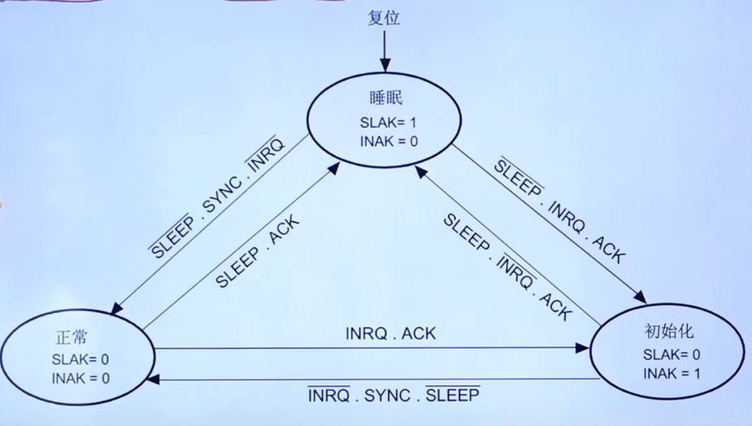

上电复位后CAN控制器默认会进入睡眠模式，作用是降低功耗。当需要将进行初始的时候（配置寄存器），会进入初始化模式。当需要通讯的时候，就进入正常模式。

## CAN控制器的3种测试模式
CAN控制器有3种测试模式：静默模式、环回模式、环回静默模式。当控制器进入初始化模式的时候才可以配置测试模式。

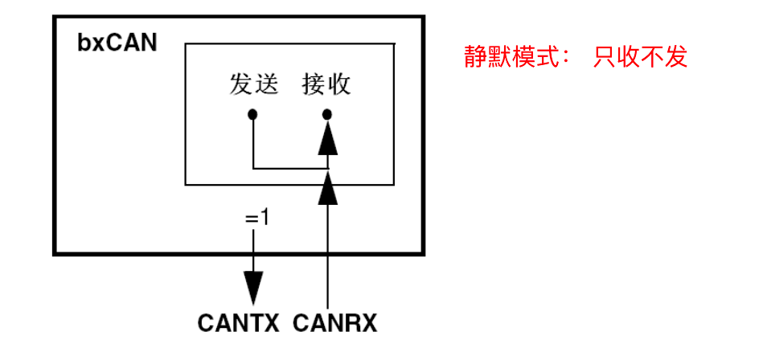

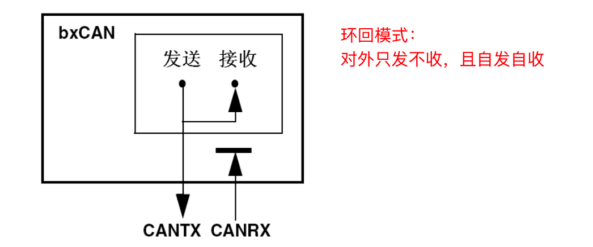


**静默模式**可以用于检测总线的数据流量。

**环回模式**可以用于自检（影响总线）。

**环回静默模式**也是用于自检，不会影响到总线。

## 功能框图  
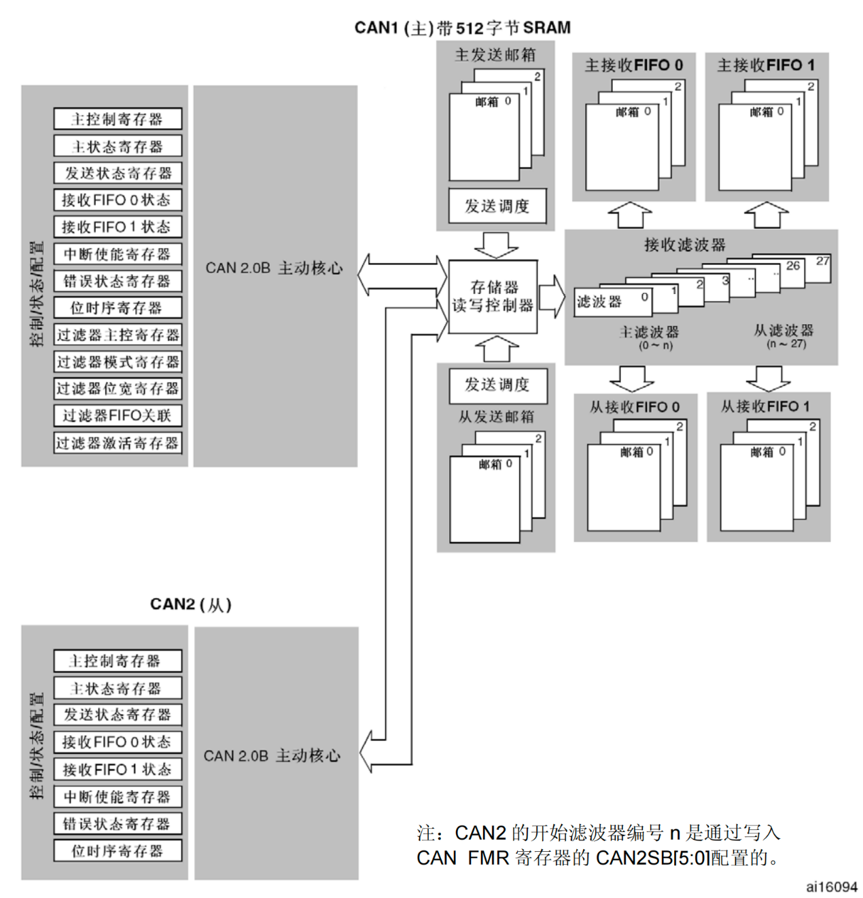

### 主动内核
含各种控制/状态/配置寄存器，可以配置模式、波特率等。在STM32CubeMx中可以非常方便的配置。

### 发送邮箱
用来缓存待发送的报文，最多可以缓存3个报文。发送调度决定报文的发送顺序。

### 接收FIFO
共有2个接收FIFO，每个FIFO都可以存放3个完整的报文。它们完全由硬件来管理。从而节省了CPU的处理负荷，简化了软件并保证了数据的一致性。应用程序只能通过读取FIFO输出邮箱，来读取FIFO中最先收到的报文。

### 接收滤波器（过滤器）
作用：对接到的报文进行过滤，最后放入FIFO 0或FIFO 1。

当总线上报文数据量很大时，总线上的设备会频繁获取报文，占用CPU。过滤器的存在，选择性接收有效报文，减轻系统负担。

有2种过滤模式：

+ 标识符列表模式，它把要接收报文的ID列成一个表，要求报文ID与列表中的某一个标识符完全相同才可以接收，可以理解为白名单管理。
+ 掩码模式（屏蔽位模式），它把可接收报文ID的某几位作为列表，这几位被称为掩码，可以把它理解成关键字搜索，只要掩码（关键字）相同，就符合要求，报文就会被保存到接收FIFO。

如果使能了过滤器，且报文的ID与所有过滤器的配置都不匹配，CAN外设会丢弃该报文，不存入接收FIFO。

每个CAN提供了14个位宽可变的、可配置的过滤器组（13~0）。每个过滤器组x由2个32位寄存器，CAN_FxR1和 CAN_FxR2组成。

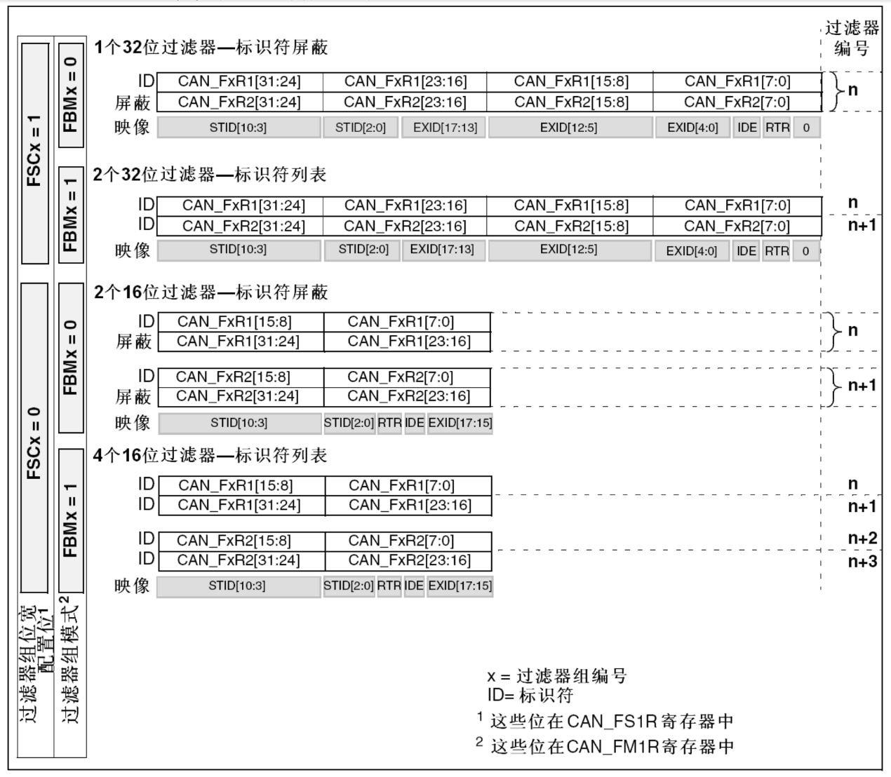

说明：

+ 当工作于32位屏蔽位模式时，FR1保存标识符，FR2保存屏蔽。FR2某位是1表示来的ID的这位必须和FR1中对应的位一致，FR2某位是0，表示ID的这位不关心。
+ 当工作于32位标识符模式时。FR1和FR2分别保存两个标识符。这意味着将来只有两个ID会匹配成功。

### STM32中CAN的位时序
STM32 外设定义的位时序与我们前面解释的 CAN 标准时序有**<font style="color:#FF0000;">一点区别</font>**。

标准时序：

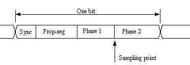

STM32的位时序：把**<font style="color:#FF0000;">传播时间段和相位缓冲段1做了合并</font>**。

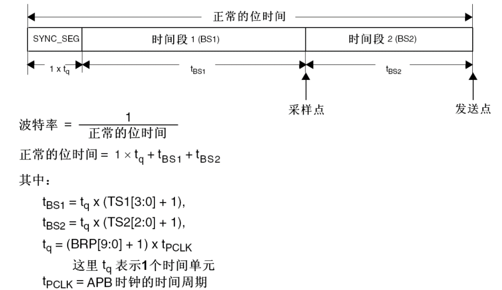

# CAN通讯案例1：环回静默模式测试
## 需求描述
我们使用环回静默模式测试CAN能否正常工作。把接收到的报文数据发送到串口输出，看是否可以正常工作。

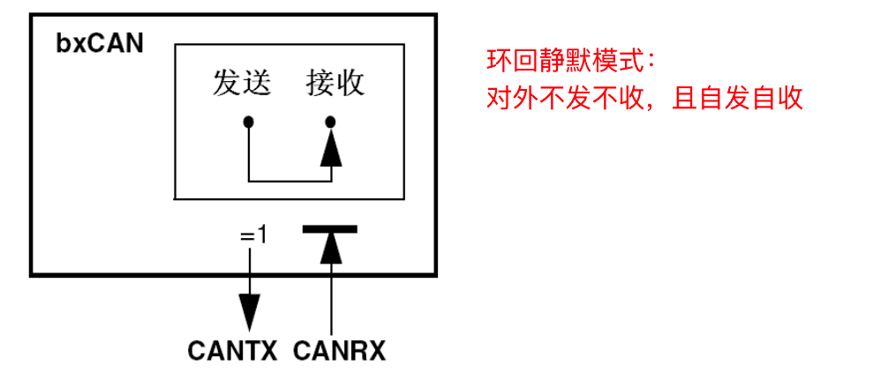 


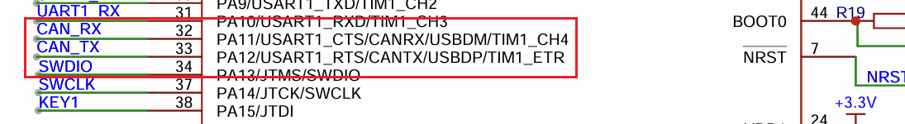

我们没有用CAN的默认引脚，而是用的重定向的引脚PB8和PB9。

## 软件设计（HAL库）
### STM32CubeMx设置
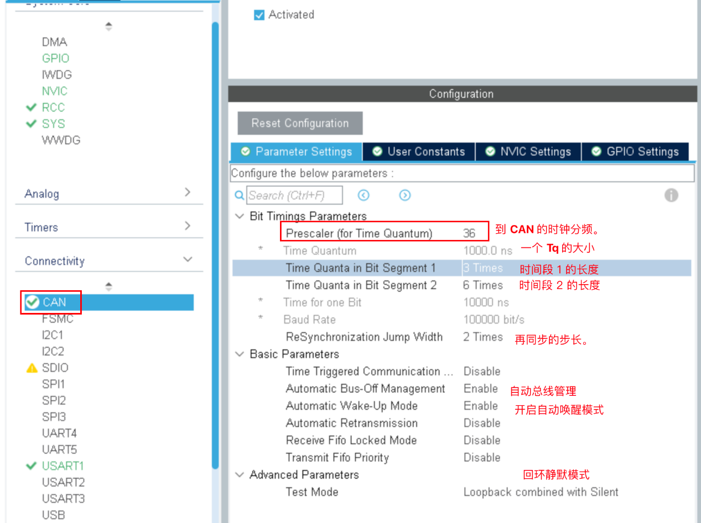

1. **<font style="color:rgb(44, 44, 54);">Time Triggered Communication (时间触发通信)</font>**<font style="color:rgb(44, 44, 54);">: 设置为"Disable"表示不启用时间触发通信模式。在时间触发通信模式下，消息的发送和接收是基于预定义的时间表，而不是事件驱动的。这种模式通常用于需要高度确定性和实时性的应用。</font>
2. **<font style="color:rgb(44, 44, 54);">Automatic Bus-Off Management (自动总线关闭管理)</font>**<font style="color:rgb(44, 44, 54);">: 设置为"Enable"意味着当CAN控制器进入总线关闭状态时，它将自动尝试重新连接到网络，而不需要外部干预。这有助于提高系统的可靠性和可用性。</font>
3. **<font style="color:rgb(44, 44, 54);">Automatic Wake-Up Mode (自动唤醒模式)</font>**<font style="color:rgb(44, 44, 54);">: 同样设置为"Enable"，这意味着CAN控制器可以在接收到有效的CAN帧时自动从睡眠模式唤醒，这对于节能和响应快速变化的应用场景非常重要。</font>
4. **<font style="color:rgb(44, 44, 54);">Automatic Retransmission (自动重传)</font>**<font style="color:rgb(44, 44, 54);">: 设置为"Disable"表示一旦消息传输失败，CAN控制器不会自动尝试重新发送该消息。在这种情况下，可能需要应用程序层来处理重传逻辑。</font>
5. **<font style="color:rgb(44, 44, 54);">Receive Fifo Locked Mode (接收FIFO锁定模式)</font>**<font style="color:rgb(44, 44, 54);">: 设置为"Disable"意味着接收FIFO（先进先出队列）可以被自由访问和修改，直到所有数据都被读取。如果启用，一旦FIFO开始填充，它将保持锁定状态，直到所有数据都被读取，这可以防止数据丢失但可能会限制灵活性。</font>
6. **<font style="color:rgb(44, 44, 54);">Transmit Fifo Priority (发送FIFO优先级)</font>**<font style="color:rgb(44, 44, 54);">: 设置为"Disable"表示发送FIFO中的消息按照它们被放置的顺序进行发送，没有优先级排序。如果启用，可以根据某些标准对消息进行优先级排序，以确保更重要的消息优先发送。</font>

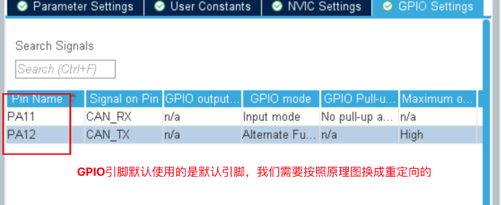

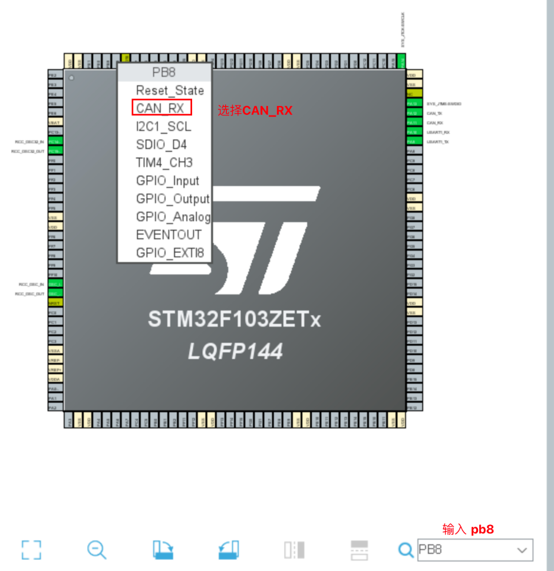

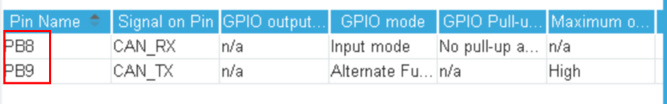

### can.h
在can.h中添加如下代码。

```c
/* USER CODE BEGIN Prototypes */
// 定义结构体类型,存储接收到的报文数据
  typedef struct
  {
    uint16_t stdID;
    uint8_t data[8];
    int8_t len;
  } RxDataMsg;

  // 配置过滤器
  void CAN_Filter_Config(void);

  // 发送报文
  void CAN_SendMsg(uint16_t stdID, uint8_t *data, uint8_t len);

  // 接收报文 将FIFO里所有的报文都接收到,放在结构体数组中,还应该返回报文个数
  void CAN_ReceveMsg(RxDataMsg rxDataMsg[], uint8_t *msgCount);
/* USER CODE END Prototypes */
```

### can.c
在can.c中添加如下代码

```c
/*USER CODE BEGIN 1 */
// 配置过滤器
void CAN_Filter_Config(void)
{
  CAN_FilterTypeDef sFilterConfig;

  // 过滤器编号  CAN1-0
  sFilterConfig.FilterBank = 0;

  // 关联的FIFO
  // sFilterConfig.FilterFIFOAssignment = 0;
  sFilterConfig.FilterFIFOAssignment = CAN_RX_FIFO0;

  // 屏蔽位模式
  // sFilterConfig.FilterMode = 0;
  sFilterConfig.FilterMode = CAN_FILTERMODE_IDMASK;

  // 位宽
  sFilterConfig.FilterScale = CAN_FILTERSCALE_32BIT;

  // 过滤器组的id(FR1)和掩码(FR2) 高低分别配置
  sFilterConfig.FilterIdHigh = 0x0000;
  sFilterConfig.FilterIdLow = 0x0000;
  sFilterConfig.FilterMaskIdLow = 0x0000;
  sFilterConfig.FilterMaskIdHigh = 0x0000;

  // 激活过滤器组
  sFilterConfig.FilterActivation = ENABLE;

  HAL_CAN_ConfigFilter(&hcan, &sFilterConfig);
}

// 发送报文
void CAN_SendMsg(uint16_t stdID, uint8_t *data, uint8_t len)
{
  // 1. 判断数据长度如果大于8 则直接退出
  if (len > 8)
  {
    printf("数据长度不能超过8个字节\n");
    return;
  }

  // 2. 判断TME状态,等待有邮箱空闲
  while (HAL_CAN_GetTxMailboxesFreeLevel(&hcan) == 0)
  {
    /* code */
  }

  // 3. 填入数据帧信息 包装成一个结构体对象
  CAN_TxHeaderTypeDef txHeader;
  // 标准帧
  txHeader.IDE = CAN_ID_STD; // 0
  // 数据帧
  txHeader.RTR = CAN_RTR_DATA;
  // id
  txHeader.StdId = stdID;
  // len
  txHeader.DLC = len;

  // 4. 请求发送数据
  uint32_t txMailBox; // 没用
  HAL_CAN_AddTxMessage(&hcan, &txHeader, data, &txMailBox);
}

// 接收报文 将FIFO里所有的报文都接收到,放在结构体数组中,还应该返回报文个数
void CAN_ReceveMsg(RxDataMsg rxDataMsg[], uint8_t *msgCount)
{
  // 1. 获取FIFO0中报文个数 保存在指针指向的空间
  *msgCount = HAL_CAN_GetRxFifoFillLevel(&hcan, CAN_RX_FIFO0);
  // 2. 循环读取每个报文
  // 定义一个头结构体对象
  CAN_RxHeaderTypeDef rxHeader;
  for (uint8_t i = 0; i < *msgCount; i++)
  {
    HAL_CAN_GetRxMessage(&hcan, CAN_RX_FIFO0, &rxHeader, rxDataMsg[i].data);

    // 将header中的信息提取到自定义结构体数组对象中
    rxDataMsg[i].stdID = rxHeader.StdId;
    rxDataMsg[i].len = rxHeader.DLC;
  }
}
/* USER CODE END 1 */
```

 

### main.c
```c
// 1.配置过滤器
CAN_Filter_Config();

// 2. 启动CAN,进入工作模式(他的初始化模式没有进入工作模式)
HAL_CAN_Start(&hcan);

printf(" CAN 通信实验,环回静默模式 寄存器版本\n");

printf("CAN 初始化配置完成 \n");

// 发送数据
uint16_t stdId = 0x066;
uint8_t *data = "abcdefg";
CAN_SendMsg(stdId, data, strlen((char *)data));
printf("发送完毕\n");

stdId = 0x067;
data = "123";
CAN_SendMsg(stdId, data, strlen((char *)data));
printf("发送完毕\n");

stdId = 0x068;
data = "xyz";
CAN_SendMsg(stdId, data, strlen((char *)data));
printf("发送完毕\n");

// 接收数据
RxDataMsg rxDataMsg[8];
uint8_t rxMsgCount;
CAN_ReceveMsg(rxDataMsg, &rxMsgCount);
printf("接收完毕!报文个数为%d\n", rxMsgCount);

for (uint8_t i = 0; i < rxMsgCount; i++)
{
printf("报文%d - stdID:%d - len:%d - data:%s\n", i + 1, rxDataMsg[i].stdID, rxDataMsg[i].len, rxDataMsg[i].data);
}
```

# CAN通讯实验2：双击测试：1发1收
## 需求描述
使用2块开发板实现CAN消息的发送和接收，一个发送数据，另外一个接收数据。

## 硬件设计
需要把2块开发的CAN_High连起来，CAN_Low连起来。连接如图所示。

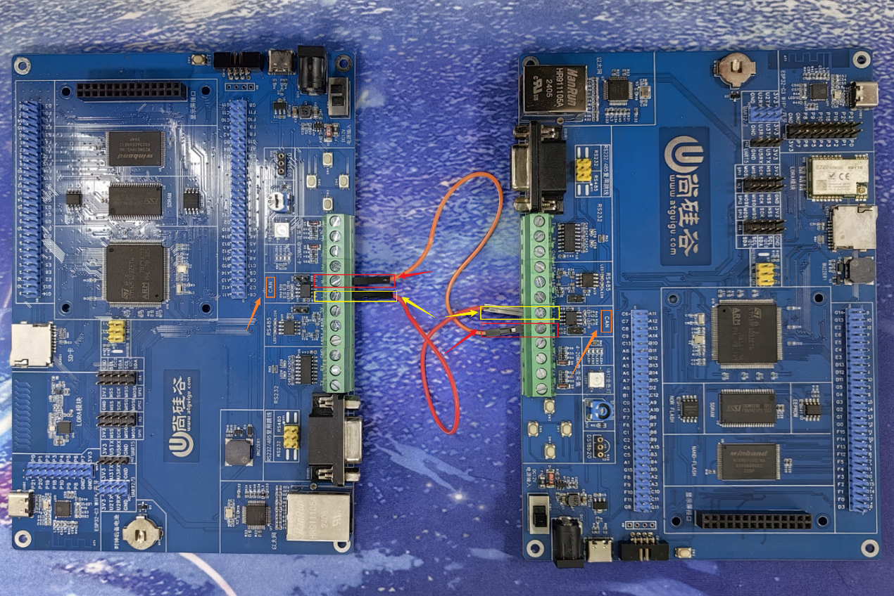

## 软件设计（HAL库）
### CubeMx设置
拷贝CAN通信实验1的HAL库版本工程2次。一个用于发送，一个用于接收。重新打开每个工程，把Test Mode改成 Normal即可，其他不用改变。然后重新生成代码。

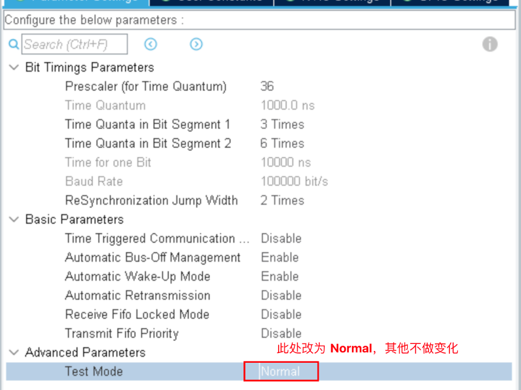

### main.c 发送
```c
int main(void)
{
    HAL_Init();
    SystemClock_Config();
    MX_GPIO_Init();
    MX_CAN_Init();
    MX_USART1_UART_Init();
    /* USER CODE BEGIN 2 */
    /* 1. 配置过滤器 */
    CAN_Filter_Config();
    /* 2. 启动CAN总线 */
    HAL_CAN_Start(&hcan);
    printf(" CAN 发送实验...\r\n");

    while (1)
    {
        uint16_t stdId = 0x011;
        uint8_t *tData = "abcdefg";
        CAN_SendMsg(stdId, tData, strlen((char *)tData));
        printf("发送完毕...\r\n");
        HAL_Delay(300);
    }
}
```

### main.c 接收
```c
int main(void)
{
    HAL_Init();
    SystemClock_Config();
    MX_GPIO_Init();
    MX_CAN_Init();
    MX_USART1_UART_Init();
    /* USER CODE BEGIN 2 */
    /* 1. 配置过滤器 */
    CAN_Filter_Config();
    /* 2. 启动CAN总线 */
    HAL_CAN_Start(&hcan);
    printf(" CAN 接收 实验...\r\n");
    /* 4. 接收数据 */
    RxDataStruct rxDataStruct[8];
    uint8_t rxMsgCount;
    while (1)
    {
        CAN_ReceveMsg(rxDataMsg, &rxMsgCount);
        /* 5. 输出消息 */
        for (uint8_t i = 0; i < rxMsgCount; i++)
        {
          printf("报文%d - stdID:%d - len:%d - data:%s\n", i + 1, rxDataMsg[i].stdID, rxDataMsg[i].len, rxDataMsg[i].data);
        }
    }
}
```
