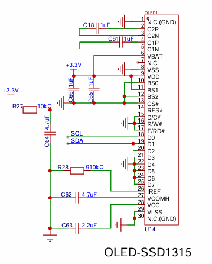

#  OLED移植

# 原理图



# OLED驱动移植
[I2C驱动代码.zip](OLED显示屏.zip) 使用I2C2

# 实现
## App_Display.h
```c
#ifndef __APP_DISPLAY_H__
#define __APP_DISPLAY_H__

#include "Int_OLED.h"

/**
 * @brief 初始化
 */
void App_Display_Init(void);

#endif /* __APP_DISPLAY_H__ */

```

## App_Display.c
```c
#include "App_Display.h"

/**
 * @brief 初始化
 */
void App_Display_Init(void)
{
    // 1. 初始化LED
    Inf_OLED_Init();

    // 2. 第一行显示汉字
    for (uint16_t i = 0; i < 7; i++)
    {
        Inf_OLED_ShowChinese(0 + 16 * i, 0, i, 16, 1);
    }

    // 3. 刷新屏幕
    Inf_OLED_Refresh();
}

```

## App_Task.h
```c
#include "App_Display.h"
```

## App_Task.c
```c
// 2. 显示任务
#define DISPLAY_TASK_NAME "display_task"
#define DISPLAY_TASK_STACK 128
#define DISPLAY_TASK_PRIORITY 7
TaskHandle_t display_task_handle;
void display_task(void *pvParameters);
#define DISPLAY_EXEC_CYCLE 10


// 2 . 创建显示任务
xTaskCreate(
    (TaskFunction_t)display_task,
    (char *)DISPLAY_TASK_NAME,
    (configSTACK_DEPTH_TYPE)DISPLAY_TASK_STACK,
    (void *)NULL,
    (UBaseType_t)DISPLAY_TASK_PRIORITY,
    (TaskHandle_t *)&display_task_handle);

// 显示任务函数
void display_task(void *pvParameters)
{
    debug_printfln("显示任务: 开始调度");
    App_Display_Init();
    uint32_t preTime = xTaskGetTickCount();
    while (1)
    {
        xTaskDelayUntil(&preTime, DISPLAY_EXEC_CYCLE);
    }
}

```
